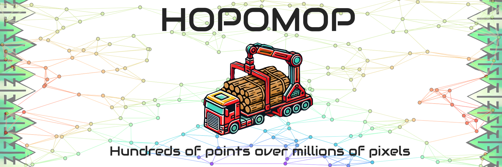
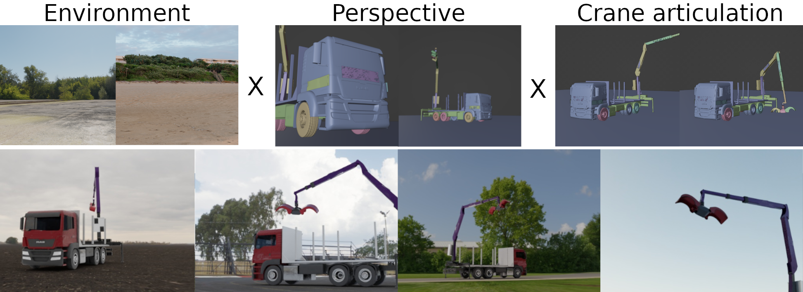
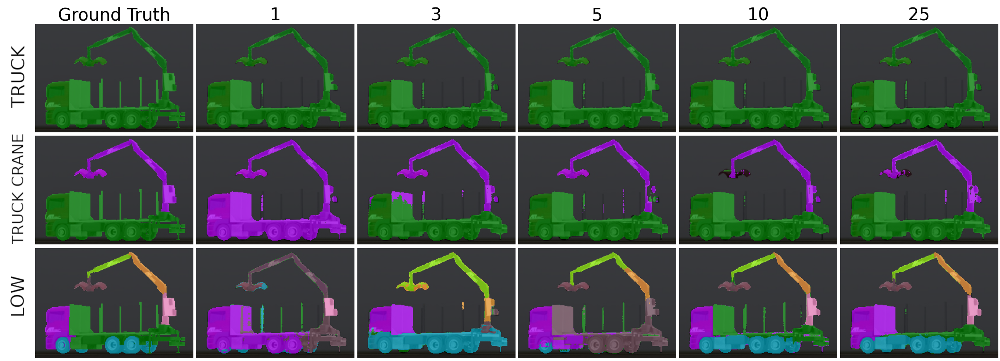
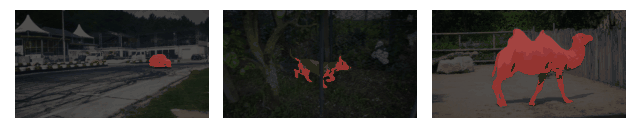
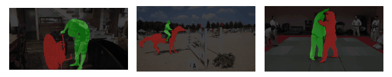

[![Contributors][contributors-shield]][contributors-url]
[![Forks][forks-shield]][forks-url]
[![Stargazers][stars-shield]][stars-url]
[![Issues][issues-shield]][issues-url]
[![MIT License][license-shield]][license-url]

# HOPOMOP (Hundreds Of Points Over Millions Of Pixels)

[contributors-shield]: https://img.shields.io/github/contributors/AIT-Assistive-Autonomous-Systems/Hopomop.svg?style=for-the-badge
[contributors-url]: https://github.com/AIT-Assistive-Autonomous-Systems/Hopomop/graphs/contributors
[forks-shield]: https://img.shields.io/github/forks/AIT-Assistive-Autonomous-Systems/Hopomop.svg?style=for-the-badge
[forks-url]: https://github.com/AIT-Assistive-Autonomous-Systems/Hopomop/network/members
[stars-shield]: https://img.shields.io/github/stars/AIT-Assistive-Autonomous-Systems/Hopomop.svg?style=for-the-badge
[stars-url]: https://github.com/AIT-Assistive-Autonomous-Systems/Hopomop/stargazers
[issues-shield]: https://img.shields.io/github/issues/AIT-Assistive-Autonomous-Systems/Hopomop.svg?style=for-the-badge
[issues-url]: https://github.com/AIT-Assistive-Autonomous-Systems/Hopomop/issues
[license-shield]: https://img.shields.io/github/license/AIT-Assistive-Autonomous-Systems/Hopomop.svg?style=for-the-badge
[license-url]: https://github.com/AIT-Assistive-Autonomous-Systems/Hopomop/blob/master/LICENSE.txt
<b>This repository contains the code for our paper, Few-shot Structure-Informed Machinery Part Segmentation with Foundation Models and Graph Neural Networks. Our approach leverages foundation models and graph neural networks to perform few-shot segmentation of machinery parts, even in complex and low-data scenarios.</b>
<!-- PROJECT LOGO -->
<br />
<div align="center">
  <a href=""https://github.com/AIT-Assistive-Autonomous-Systems/Hopomop">
    
  </a>

  <p align="center">
    <a href="https://arxiv.org/abs/2501.10080">📝Link to Paper📝</a>
  </p>
</div>

To help you get started, we provide a small set of synthetic truck images in data/test_data, which you can use for quick testing. For a detailed explanation of the methodology, implementation, and results, please refer to our paper.

## Installation

### Option 1: Using Docker (Recommended)

For a streamlined and reproducible setup, we provide a Docker Devcontainer. This ensures a properly configured environment with all necessary dependencies.
<b>Prerequisites:</b>
- Docker (including NVIDIA Docker for GPU acceleration)
- VS Code with the Dev Containers extension

To get started, simply open the repository in VS Code and launch the Devcontainer. The setup process will handle all required installations automatically, including downloading the necessary weights.

### Option 2: Local Installation
If you prefer running the code directly on your machine, follow these steps:

1. <b>Install the required dependencies:</b>

        pip install -r requirements.txt

2. <b>Install PyTorch with CUDA 12.1 support (recommended for GPU acceleration):</b>

        pip3 install torch torchvision torchaudio --index-url https://download.pytorch.org/whl/cu121

<b>SuperPoint Weights (Local Installation Only)</b>

For local setups, you need to manually download the three required [SuperPoint weight](https://github.com/magicleap/SuperGluePretrainedNetwork/tree/master/models/weights) files from the SuperGlue repository and place them in:

    foundation_graph_segmentation/interest_point_detectors/superpoint/weights/

For further details, please refer to our paper.

## Usage  

The repository includes three trained checkpoints stored in the `checkpoints` folder. Each checkpoint corresponds to a different segmentation granularity:  

- **TRUCK**  
- **TRUCK CRANE**  
- **LOW**  

These checkpoints were trained on the synthetic truck dataset.  

Each granularity has a corresponding configuration file in the `config` folder. The configuration files define the parameters for training and testing. Feel free to experiment with them! 

### Testing
To run inference on the test images, use the following command, replacing the config file with the one matching the granularity you want to test:  

```bash
python3.10 test.py --config_file config/parameters_test_TRUCK.yaml
python3.10 test.py --config_file config/parameters_test_TRUCK_CRANE.yaml
python3.10 test.py --config_file config/parameters_test_LOW.yaml
```

The results will be saved in the ```results``` folder.
### Training
To train a model from scratch, use the following command with the desired configuration file:

```bash
python3.10 train.py --config_file config/parameters_train_TRUCK.yaml
python3.10 train.py --config_file config/parameters_train_TRUCK_CRANE.yaml
python3.10 train.py --config_file config/parameters_train_LOW.yaml
```
The trained model will be saved in the ```checkpoints``` folder.
## Architecture

Combination of [SuperPoint](https://github.com/rpautrat/SuperPoint), [CLIPSeg](https://github.com/timojl/clipseg), [Segment Anything](https://github.com/facebookresearch/segment-anything) and Graph Neural Networks.


## Data
### Domain Randomization
Using blender to create synthetic images by randomizing environment, perspective anc crane articulation.

### Sample
Rendered video of the synthetic truck with changing perspective, background, lighting and articulation. Right side shows rendering, left side shows segmentation overlay.


## Results
### Few-shot evaluation
Different granularity and sample sizes. Qualitative results on synthetic truck dataset.



### Simulation to Real Transfer
Training on 10 synthetic images. The synthetic truck-mounted loading crane differs from the real one. The model is able to transfer the knowledge to the real world.


### Semi-Supervised Video Segmentation
Using [Davis2017](https://davischallenge.org/) Dataset. Trained on First, Middle and Last Frame.

| Segmentation Classes     | Image                  |
|----------------|------------------------|
| One Class      |  |
| Two Classes    |  |
| Multi Classes  |  |


## Meet the Authors 👩‍🔬
This work was conducted at the [AIT Austrian Institute of Technology](https://www.ait.ac.at/) 🇦🇹 in the [Center for Vision, Automation & Control](https://www.ait.ac.at/en/about-the-ait/center/center-for-vision-automation-control) 🏗️.

| Name & Email                                      | AIT Research Profile | Google Scholar |
|---------------------------------------------------|----------------------|----------------|
|👨‍🔬 **Michael Schwingshackl**<br>📧[Michael.Schwingshackl@ait.ac.at](mailto:Michael.Schwingshackl@ait.ac.at) | [🔗 Profile](https://publications.ait.ac.at/de/persons/michael-schwingshackl) | [🔗 Scholar](https://scholar.google.at/citations?user=fsvMYQYAAAAJ&hl) |
|👨‍🔬 **Fabio Francisco Oberweger**<br>📧[Fabio.Oberweger@ait.ac.at](mailto:Fabio.Oberweger@ait.ac.at) | [🔗 Profile](https://publications.ait.ac.at/de/persons/fabio.oberweger) | [🔗 Scholar](https://scholar.google.at/citations?hl=de&user=njm6I3wAAAAJ) |
|👨‍🔬 **Markus Murschitz**<br>📧[Markus.Murschitz@ait.ac.at](mailto:Markus.Murschitz@ait.ac.at) | [🔗 Profile](https://publications.ait.ac.at/de/persons/markus.murschitz) | [🔗 Scholar](https://scholar.google.at/citations?hl=de&user=S8yQbTQAAAAJ) |


## Full Dataset Access  
The provided test images allow you to evaluate the approach on a small sample of our synthetic truck dataset. If you require access to the full dataset for research or further experiments, please reach out to us.  

For inquiries, feel free to contact us.  

## Citing Hopomop
If you use Hopomop in your research, please use the following BibTeX entry.

```
@InProceedings{Schwingshackl_2025_WACV,
    author    = {Schwingshackl, Michael and Oberweger, Fabio F. and Murschitz, Markus},
    title     = {Few-Shot Structure-Informed Machinery Part Segmentation with Foundation Models and Graph Neural Networks},
    booktitle = {Proceedings of the Winter Conference on Applications of Computer Vision (WACV)},
    month     = {February},
    year      = {2025},
    pages     = {1989-1998}
}
```

